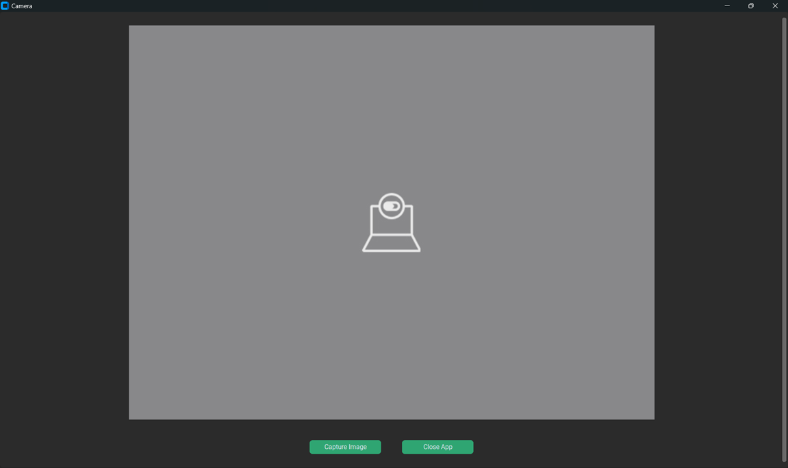
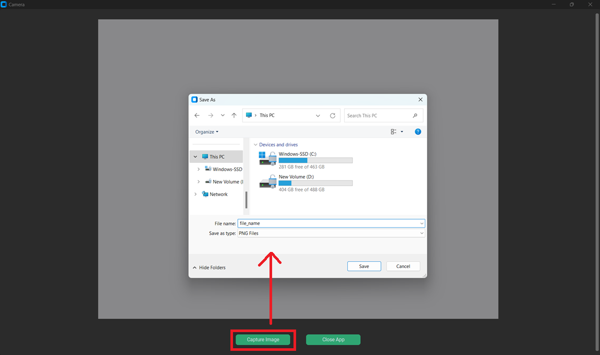

# Camera App with Image Capturing using OpenCV

A Camera App built using `Python` and `CustomTkinter`, providing a live camera feed and the ability to capture and save images directly from the video stream.

## Features
1. **Live Camera Feed**: Displays a real-time video feed from your system's camera.
2. **Capture Image**: Allows capturing a frame from the video feed and saving it as an image file.
3. **User-Friendly Interface**: Built with CustomTkinter for a modern and responsive GUI.
4. **Save Image**: Supports saving images in .png or .jpg formats.

## Installation
### Prerequisites
Ensure you have Python installed (version **3.8** or later).

### Install Required Libraries
Install all dependencies listed in the requirements.txt file. Use the following command:
   ```python
      python -m pip install -r requirements.txt
   ```
## Camera App UI 

#### User Interface 
 

#### Capture Image and Save in the System
 

## App Features

   * The app will open the default system camera and display the live feed.
   * Click the **Capture Image** button to take a snapshot of the current frame.
   * Save the captured image to your preferred location by selecting a file format and path.
   * Click **Close App** to exit the application.
     
## Creating Executable Application of this Project using Pyinstaller
**[Please refer to the Pyinstaller.md file](Pyinstaller.md)**

## Important Note:
1. Ensure the system camera is functional and accessible.
2. If the app cannot access the camera, an error dialog will appear, and the app will close.
3. Saved images will retain the current frame's resolution and orientation.

## License
This project is licensed under the MIT License. Feel free to use and modify it as needed
