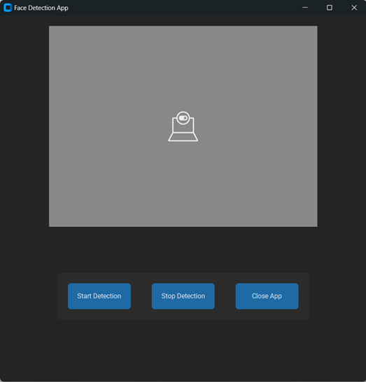

# Face Detection using Facenet Pytorch

This project is GUI based **Face Detection Application** using __Python__. It uses the facenet-pytorch library for face detection and customtkinter for creating the graphical user interface (GUI). The app displays a live camera feed and allows you to detect faces in real-time.

## Features
1. **Live Camera Feed**: Streams real-time video from the default webcam.
2. **Face Detection**: Highlights faces in the camera feed with bounding boxes.
3. **Start/Stop Detection**: Easily enable or disable face detection.
4. **User-Friendly GUI**: Simple and dark-themed interface built with customtkinter.

## Installation
### Prerequisits
Ensure you have Python installed (version **3.8** or later).

### Install Required Libraries
Install all dependencies listed in the requirements.txt file. Use the following command:
```python
python -m pip install -r requirements.txt
```

## Face Detection App UI 


## Usage 
1. **Run the Application**:
     * Execute the Python script in your terminal or IDE:
```python
python Face_Detection.py
```
2. **Start Face Detection**:
    * Click the "Start Detection" button to enable face detection.
    * Detected faces will be highlighted with green rectangles.

3. **Stop Face Detection**:
    * Click the "Stop Detection" button to pause face detection.

4. **Close the App**:
    * Click the "Close App" button to stop the video stream and exit the application.


## Code Overview
### Key Components

1. **Libraries Used**:
    * **cv2**: For accessing the webcam and drawing bounding boxes on frames.
    * **facenet_pytorch**: For face detection using the MTCNN model.
    * **customtkinter**: For creating the GUI.
    * **PIL (Pillow)**: For image manipulation and converting OpenCV frames for display.

2. **Face Detection**:
   * The app uses the **[MTCNN (Multi-Task Cascaded Convolutional Networks)](https://arxiv.org/pdf/1604.02878)** model for detecting faces in the live video feed.

3. **GUI Design**:
   * **Labels**: Used to display the live camera feed and face detection messages.
   * **Buttons**: Control face detection and application behavior.
  
## Troubleshooting

1. **No Camera Detected**:
   * Ensure your webcam is connected and not in use by another application.
   * Verify the cv2.VideoCapture(0) parameter. Change 0 to another index if you have multiple cameras.

2. **Module Not Found**:
   * Ensure all dependencies are installed correctly using ```python -m pip install -r requirements.txt```

3. **Face Detection Not Working**:
   * Check if the facenet-pytorch library is installed properly.
   * Verify your camera feed is clear and well-lit for better detection accuracy.
  
## License
This project is licensed under the MIT License. Feel free to use and modify it as needed


### Happy Detecting **:)**
