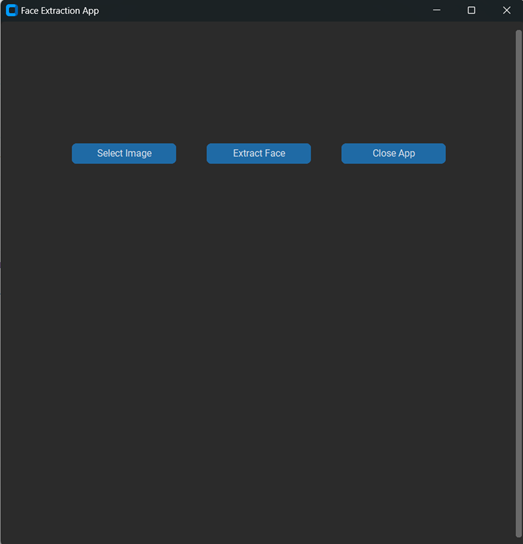

# Face Extraction App

A Face Extraction App built using Python, leveraging MTCNN (Multi-task Cascaded Convolutional Networks) for face detection. This app allows you to select an image, detect faces within the image, and extract them into smaller cropped faces displayed on the interface.

## Features
1. **Select Image**: Choose an image file for face detection and extraction.
2. **Face Detection**: Automatically detects all faces present in the image.
3. **Face Extraction**: Displays all detected faces as separate, cropped thumbnails.
4. **Responsive Interface**: Built with CustomTkinter for a modern, scrollable, and user-friendly GUI.
5. **Dynamic Grid Layout**: Cropped faces are displayed dynamically in a grid layout.
 

## Installation
### Prerequisits
Ensure you have Python installed (version **3.8** or later).

### Install Required Libraries
Install all dependencies listed in the requirements.txt file. Use the following command:
   ```python
      python -m pip install -r requirements.txt
   ```

## Face Extraction App UI 
#### User Interface 
 

#### Extracted Face from uploaded image


## Usage 
1. **Run the Application**:
     * Execute the Python script in your terminal or IDE:
     ```python
        python Face_Extraction.py
     ```
2. **Select Image**:
    * Click the "Select Image" button to to upload image from the system.
    * Selected image will be displayed on the screen.

3. **Extract Face**:
    * Click the "Extract Face" button to extract faces from the image.

4. **Close the App**:
    * Click the "Close App" button to exit the application.

## Code Overview
### Key Components

1. **Libraries Used**:
    * **cv2**: For accessing the webcam and drawing bounding boxes on frames.
    * **facenet_pytorch**: For face detection using the MTCNN model.
    * **customtkinter**: For creating the GUI.
    * **PIL (Pillow)**: For image manipulation and converting OpenCV frames for display.

2. **Face Extraction**:
   * The app uses the **[MTCNN (Multi-Task Cascaded Convolutional Networks)](https://arxiv.org/pdf/1604.02878)** model for detecting faces in the image and extracting the face area.

3. **GUI Design**:
   * **Labels**: Used to display the uploaded image and extracted face.
   * **Buttons**: Controls the application behavior.

## Creating Executable Application of this Project using Pyinstaller
**[Please refer to the Pyinstaller.md file](Pyinstaller.md)**

## Troubleshooting

1. **Image Upload Error**:
   * Ensure uploaded image should be in .png , .jpg , .jpeg format.
  
2. **Module Not Found**:
   * Ensure all dependencies are installed correctly using ```python -m pip install -r requirements.txt```

  
## License
This project is licensed under the MIT License. Feel free to use and modify it as needed
