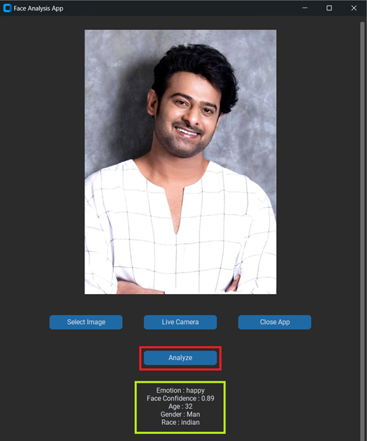

# Face Analysis Application

A Face Analysis Application developed using `Python`, `CustomTkinter`, and [DeepFace](https://github.com/serengil/deepface) to analyze facial features. 
The app supports both live camera feed and static image analysis.

## Features

1. **Live Camera Feed**: Real-time video feed from the default system camera for facial analysis.
2. **Upload Image**: Upload a static image from your system for analysis.
3. **Facial Analysis**:
     *  Extract insights including :
         * Emotion
         * Age
         * Gender
         * Race
         * Face Confidence
                        
5. **User-Friendly Interface**: Built with CustomTkinter for a modern, responsive design.

## Why DeepFace

1. DeepFace is widely used for face analysis due to its versatility, accuracy, and user-friendly design.
2. DeepFace provides access to multiple state-of-the-art face recognition models, including:
   * VGG-Face
   * Google FaceNet
   * OpenFace
   * DeepID
   * ArcFace
   * Dlib
     
3. DeepFace achieves near-human accuracy in face recognition tasks by leveraging deep learning models trained on large, high-quality datasets.
4. DeepFace uses pretrained models, there’s no need to spend time and computational resources retraining models unless you want to fine-tune them for a custom dataset.
   
## Installation
### Prerequisites
Ensure you have Python installed (version **3.8** or later).

### Install Required Libraries
Install all dependencies listed in the requirements.txt file. Use the following command:
   ```python
      python -m pip install -r requirements.txt
   ```
### Run the project
   ```python
      python Face_Analysis.py
   ```

## Face Analysis App UI 


User Interface            |  Live Camera Image
:-------------------------:|:-------------------------:
   |  

Select Image from System            |  Face Analysis on Image
:-------------------------:|:-------------------------:
  |  

## Usage
1. **Select Image**:
   * Upload an image from your system using the Select Image button.
   * The selected image will be displayed in the application.

2. **Live Camera**:
   * Start the live video feed by clicking Live Camera.
   * Analyze the live feed in real time.

3. **Analyze**:
   * Click the Analyze button to perform facial analysis.
   * Results will be displayed, including emotion, age, gender, race, and confidence score.

4. **Close App**:
   * Click Close App to exit the application.

5. **Result**:
   * Results from the facial analysis are shown as text below the image.

## Creating Executable Application of this Project using Pyinstaller
**[Please refer to the Pyinstaller.md file](Pyinstaller.md)**

## Important Notes

1. **Camera Access**: Ensure your system's camera is functional and accessible.
2. **DeepFace Analysis**:
   * The app uses the DeepFace library for facial analysis.
   * It requires proper facial alignment for accurate predictions.
3. **Error Handling**:
   * If no face is detected or the image is invalid, appropriate error messages will be displayed.
  

## License
This project is licensed under the MIT License. Feel free to use and modify it as needed
