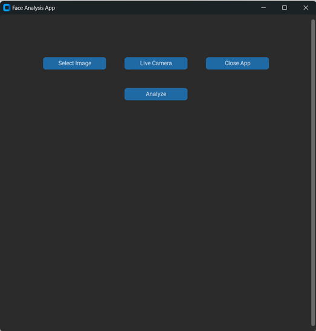
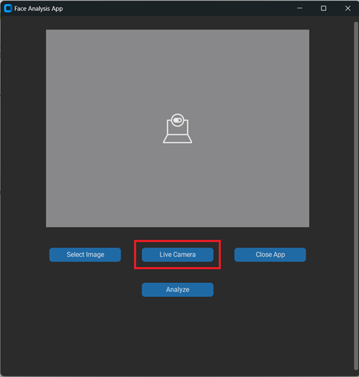
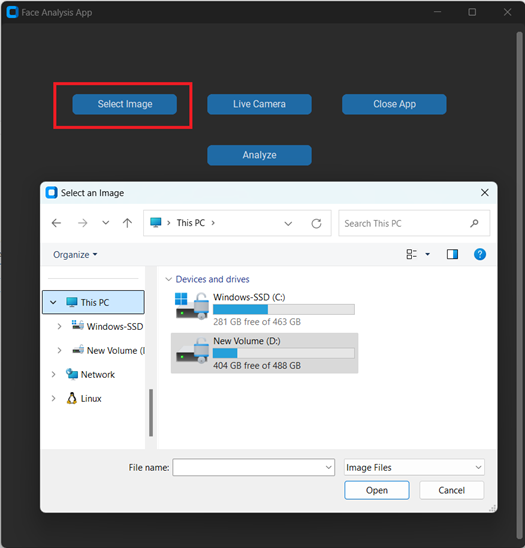

# Face Analysis Application

A Face Analysis Application developed using `Python`, `CustomTkinter`, and `DeepFace` to analyze facial features such as **emotion**, **age**, **gender**, **race**, and **face confidence**. 
The app supports both live camera feed and static image analysis.

## Features

1. **Live Camera Feed**: Real-time video feed from the default system camera for facial analysis.
2. **Upload Image**: Upload a static image from your system for analysis.
3. **Facial Analysis**:
     *  Extract insights including :
         * Emotion
         * Age
         * Gender
         * Race
         * Face Confidence
                        
5. **User-Friendly Interface**: Built with CustomTkinter for a modern, responsive design.


## Installation
### Prerequisites
Ensure you have Python installed (version **3.8** or later).

### Install Required Libraries
Install all dependencies listed in the requirements.txt file. Use the following command:
   ```python
      python -m pip install -r requirements.txt
   ```

## Face Analysis App UI 

#### User Interface 
 

#### Live Camera Image


#### Select Image from System


#### Face Analysis on Image


User Interface            |  Live Camera Image
:-------------------------:|:-------------------------:
[](https://www.youtube.com/watch?v=1oq1Ye7dFqc)  |  [](https://www.youtube.com/watch?v=eUSgtfK4ivk)

Select Image from System            |  Face Analysis on Image
:-------------------------:|:-------------------------:
[](https://www.youtube.com/watch?v=1oq1Ye7dFqc)  |  [](https://www.youtube.com/watch?v=eUSgtfK4ivk)

