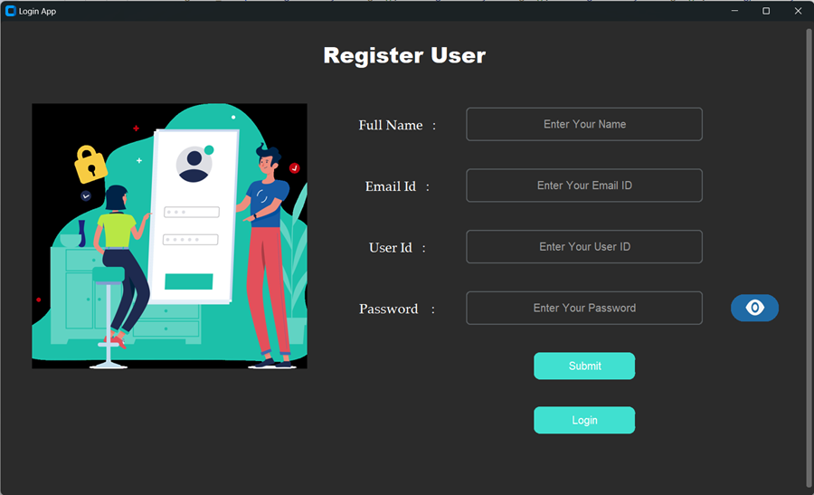
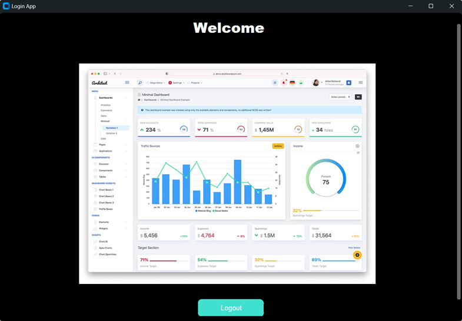

# Login & Registration Application using Sqlite

This project is a desktop application created with **CustomTkinter**, **SQLite**, **OpenCV**, and **Pillow**, providing a modern and user-friendly interface. It includes key features such as:
* **User Registration**: Allows new users to register with their full name, email, username, and password.
* **User Login**: Validates user credentials and grants access to a welcome screen upon successful login.
* **Password Visibility Toggle**: Includes a password toggle (show/hide).
* **Dynamic Screen Transition**: Transitions between login, registration, and dashboard views.


## Features
1. **Database**
   * SQLite Database:
     * Stores user details such as full name, email, username, and password.
     * Automatically creates the login_users table if it doesn't exist.
2. **User Interface**
   * CustomTkinter Components:
     * <u>Login Screen</u>: Includes fields for username and password with a password visibility toggle.
     * Registration Screen: Allows users to input their name, email, username, and password.
     * Dashboard Screen: Displays a welcome message and an option to log out.
     * Image Integration: Displays images in the login and dashboard screens using OpenCV and Pillow.
       
3. **Security**
   * Password fields use the show="*" property to mask input, ensuring privacy.


## Installation
### Prerequisites
Ensure you have Python installed (version **3.8** or later).

### Install Required Libraries
Install all dependencies listed in the requirements.txt file. Use the following command:
   ```python
      python -m pip install -r requirements.txt
   ```

## Usage 
* **Run the Application**:
     * Execute the Python script in your terminal or IDE:
     ```python
        python Login_App.py
     ```


## Face Extraction App UI 
#### Login UI 
 

#### Registration UI


#### Logged In Dashboard



## Application Flow
1. **Login Screen**:
   * Enter *username* and *password*.
   * Click **Login** to authenticate.
   * If credentials are invalid, an error message is displayed.
   * New users can click **Register** to navigate to the registration screen.

2. **Registration Screen**:
   * Fill in all fields and click **Submit** to register.
   * On successful registration, navigate back to the login screen.
  
3. **Dashboard**:
   * Welcome screen with a logout button.
   * Clicking **Logout** returns to the login screen.


## Creating Executable Application of this Project using Pyinstaller
**[Please refer to the Pyinstaller.md file](Pyinstaller.md)**


## License
This project is licensed under the MIT License. Feel free to use and modify it as needed
