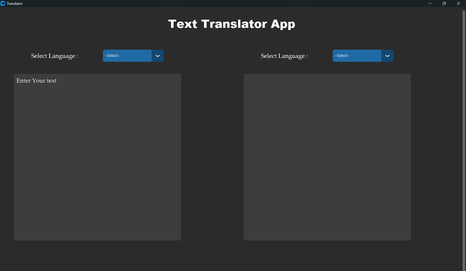
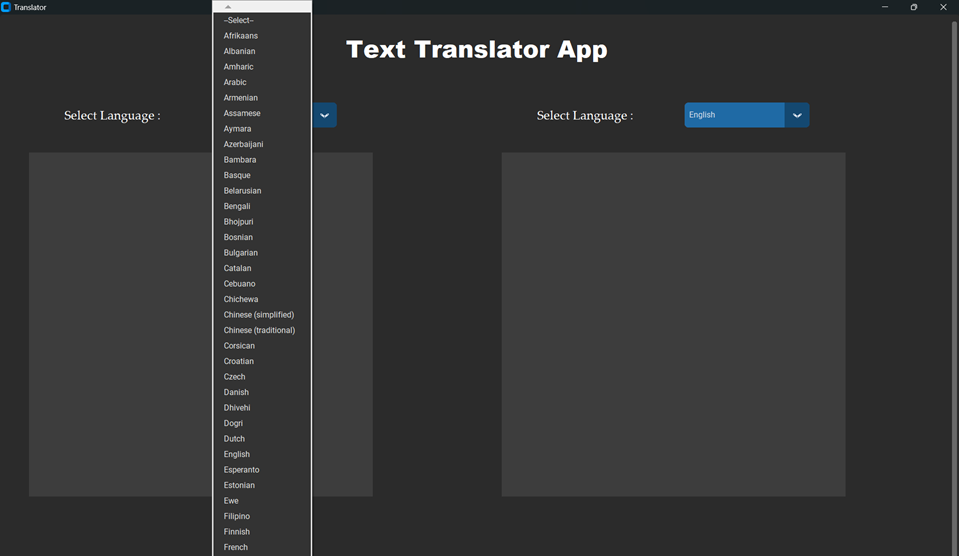
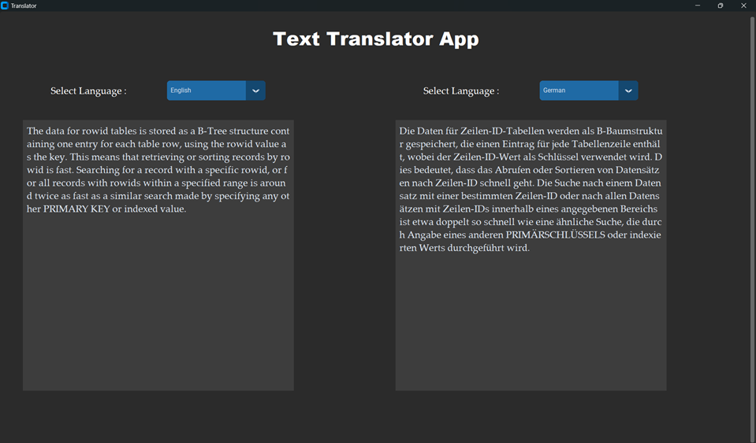
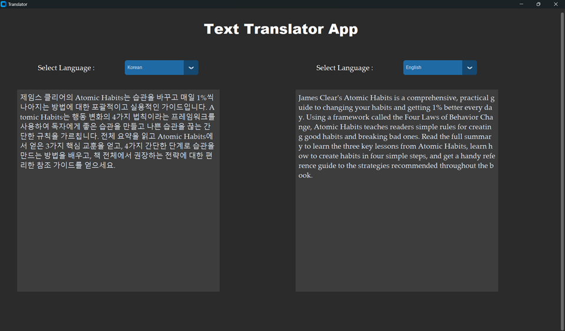

# Text Translator App

A simple, intuitive, and responsive text translation application built with Python and CustomTkinter. This app leverages the Google Translator API to translate text between multiple languages in real time.

## Features
- **Real-time Translation**: Translates text on the fly as you type.
- **Multi-language Support**: Supports a wide range of languages from Afrikaans to Zulu.
- **Responsive GUI**: Scrollable frames with adaptive layout to fit different screen sizes.
- **Custom Themes**: Dark mode interface with blue accents.
- **User Friendly**: Simple dropdowns to select source and target languages.

## Technologies Used
- **Python 3.8** and above
- **CustomTkinter** (Modern Tkinter framework for GUI development)
- **GoogleTranslator** from `deep_translator` library
- **Tkinter** (Standard GUI toolkit for Python)

## Installation
### Prerequisites
Ensure you have Python installed (version **3.8** or later).

### Install Required Libraries
Install all dependencies listed in the requirements.txt file. Use the following command:
   ```python
      python -m pip install -r requirements.txt
   ```
### Usage 
1. Run the project
   ```python
      python Text_Translator.py
   ```
2. The application window will launch.
3. Select the source language and target language from the dropdown menus.
4. Type or paste text into the left text box.
5. The translated text will automatically appear in the right text box.

## Language Support
The app supports translation between over **133 languages**, including:
- English
- French
- German
- Spanish
- Chinese (Simplified & Traditional)
- Hindi
- Arabic


## Translator App UI 

User Interface            |  Language Select Option
:-------------------------:|:-------------------------:
   |  

English to German Translation           |  Korean to English Translation
:-------------------------:|:-------------------------:
  |  

## Creating Executable Application of this Project using Pyinstaller
**[Please refer to the Pyinstaller.md file](Pyinstaller.md)**

## Known Issues
- Internet connection is required for translation.
- If unsupported languages are selected, the app may display an error.


## License
This project is licensed under the MIT License. Feel free to use and modify it as needed
